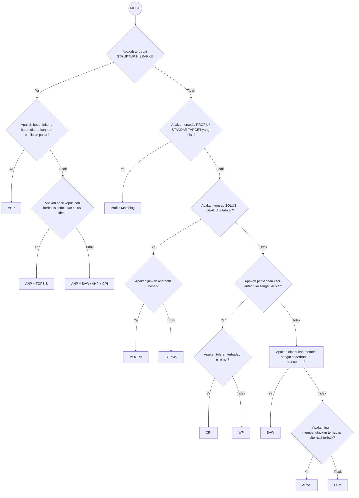

Dalam konteks **Decision Support System (DSS)**, pemilihan metode MCDM (Multi-Criteria Decision Making) yang tepat **bukan ditentukan oleh “metode mana yang paling populer”**, melainkan oleh **karakteristik masalah keputusan** yang dihadapi.

Berikut adalah **kerangka pertimbangan sistematis** yang dapat Anda gunakan untuk menentukan metode yang paling sesuai. Sesuai dengan materi yang kita pelajari, kita akan membandingkan metode **SAW, Exponential Comparison Method (ECM), AHP, WP, MOORA, TOPSIS, CPI, ARAS, dan Profile Matching (PM)**.

---

## 1. Struktur dan Sifat Masalah Keputusan

**Pertanyaan kunci:**
- Apakah masalah bersifat **sederhana atau kompleks**?
- Apakah terdapat **struktur hierarkis tujuan–kriteria–subkriteria**?

**Implikasi metode:**
- **AHP** → sangat tepat untuk masalah **kompleks dan hierarkis**
- **SAW, WP, MOORA, CPI** → cocok untuk masalah **langsung (flat)** tanpa hierarki
- **PM** → cocok bila ada **profil target/standar ideal** yang jelas

---

## 2. Cara Penentuan Bobot Kriteria

**Pertanyaan kunci:**
- Apakah bobot kriteria **sudah diketahui** atau **harus diturunkan dari penilaian pakar**?

|Kondisi|Metode yang sesuai|
|---|---|
|Bobot subjektif dari pakar|**AHP**|
|Bobot sudah ditentukan|SAW, WP, MOORA, TOPSIS, CPI, ARAS|
|Perbandingan dominansi eksponensial|**ECM**|

**Catatan DSS:**  
- Jika bobot **krusial dan sulit ditentukan secara langsung**, AHP sering digunakan sebagai **metode penentu bobot**, lalu dikombinasikan dengan metode lain.

---

## 3. Skala dan Jenis Data

**Pertanyaan kunci:**
- Apakah data berskala **rasio, interval, atau ordinal**?
- Apakah terdapat **nilai nol**?

|Metode|Karakteristik Data|
|---|---|
|**SAW, MOORA, ARAS, CPI**|Data kuantitatif umum|
|**WP**|Tidak toleran terhadap nilai nol|
|**AHP**|Data kualitatif & kuantitatif|
|**PM**|Data berbasis selisih terhadap standar|

---

## 4. Sensitivitas terhadap Perbedaan Nilai

**Pertanyaan kunci:**
- Apakah perbedaan kecil antar alternatif **harus terlihat jelas**?

|Tingkat Sensitivitas|Metode|
|---|---|
|Rendah–sedang|SAW, MOORA|
|Tinggi|**WP, CPI, ECM**|
|Relatif terhadap solusi ideal|**TOPSIS, ARAS**|

---

## 5. Konsep Solusi Ideal

**Pertanyaan kunci:**
- Apakah keputusan didasarkan pada **kedekatan dengan solusi terbaik dan terburuk**?

|Konsep|Metode|
|---|---|
|Solusi ideal (+/–)|**TOPSIS**|
|Alternatif referensi terbaik|**ARAS**|
|Profil standar|**PM**|

---

## 6. Transparansi dan Kemudahan Pemahaman

**Pertanyaan kunci:**
- Apakah hasil harus **mudah dijelaskan ke stakeholder non-teknis**?

|Tingkat Interpretabilitas|Metode|
|---|---|
|Sangat mudah|**SAW, CPI, PM**|
|Sedang|MOORA, ARAS|
|Relatif kompleks|AHP, TOPSIS, WP|

---

## 7. Skala Jumlah Alternatif

**Pertanyaan kunci:**
- Apakah jumlah alternatif **besar (puluhan/ratusan)**?

|Skala Alternatif|Metode|
|---|---|
|Sedikit–sedang|AHP, TOPSIS|
|Banyak|**SAW, MOORA, CPI, ARAS**|

---

## 8. Tujuan Implementasi DSS

**Pertanyaan kunci:**
- Apakah DSS bersifat **akademik, operasional, atau strategis**?

|Tujuan DSS|Metode yang Umum|
|---|---|
|Akademik / pembelajaran|AHP, TOPSIS|
|Operasional cepat|SAW, CPI, MOORA|
|Strategis & kebijakan|AHP + TOPSIS / AHP + CPI|
|SDM / seleksi berbasis standar|PM|

---

## 9. Ringkasan Pemetaan Cepat

|Kondisi Utama|Metode Paling Relevan|
|---|---|
|Sederhana & cepat|SAW|
|Bobot sangat menentukan|AHP|
|Perbedaan kecil krusial|CPI / WP|
|Pendekatan ideal solution|TOPSIS|
|Banyak alternatif|MOORA|
|Ada profil standar|PM|
|Alternatif pembanding terbaik|ARAS|
|Dominansi ekstrem|ECM|

**Decision Tree Menentukan Metode**

---

## Kesimpulan DSS

> **Tidak ada metode yang “paling benar” secara universal.**  

Metode yang tepat adalah metode yang:
1. **Selaras dengan struktur masalah**
2. **Konsisten dengan karakter data**
3. **Dapat dijelaskan kepada pengambil keputusan**
4. **Efisien untuk skala dan tujuan DSS**
