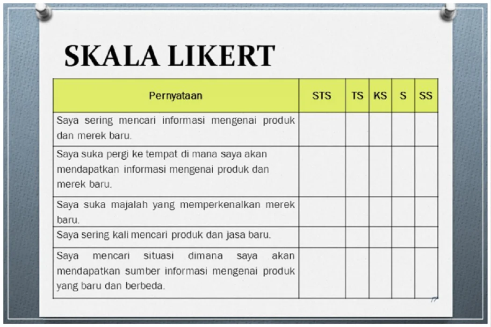
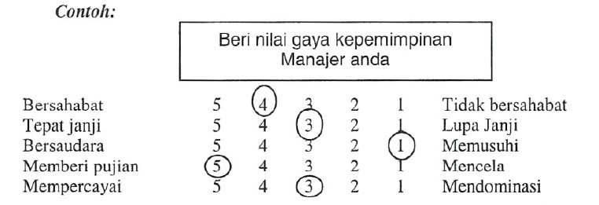

# Skala Pengukuran Kuesioner
 

Dalam sistem pendukung keputusan (_Decision Support System_), data yang digunakan sering berasal dari **penilaian subjektif pengguna** — misalnya persepsi, kepuasan, atau preferensi terhadap alternatif keputusan.  
Untuk memperoleh data tersebut secara terukur, digunakan **instrumen kuesioner dengan berbagai jenis skala pengukuran**.

Jenis skala pengukuran menentukan bagaimana:
- Pertanyaan disusun,    
- Jawaban diberi bobot, dan    
- Hasil diinterpretasikan untuk analisis dalam DSS.
    
Berikut beberapa skala pengukuran yang biasa digunakan untuk mengolah data kuisioner:
- Skala Likert    
- Skala Guttman    
- Skala Semantic Differential    
- Skala Rating (Numerical Rating)    
- Skala Thurstone

---

## 1. Skala Likert

#### 📘 Definisi:

Skala Likert digunakan untuk **mengukur sikap, pendapat, atau persepsi** seseorang terhadap suatu objek dengan **rentang jawaban berurutan dari sangat negatif ke sangat positif.**

#### 💡 Contoh:

> **Petunjuk:**  
> Berilah tanda (✓) pada kolom yang sesuai dengan pendapat Anda terhadap setiap pernyataan berikut.

| No  | Pernyataan                       | Sangat Tidak Setuju (1) | Tidak Setuju (2) | Netral (3) | Setuju (4) | Sangat Setuju (5) |
| --- | -------------------------------- | ----------------------- | ---------------- | ---------- | ---------- | ----------------- |
| 1   | Sistem mudah digunakan           | ☐                       | ☐                | ☐          | ☐          | ☐                 |
| 2   | Sistem sering mengalami gangguan | ☐                       | ☐                | ☐          | ☐          | ☐                 |

#### ⚙️ Karakteristik:

- Jenis skala: **Ordinal (sering diperlakukan sebagai interval)**
    
- Dapat digunakan untuk menghitung **rata-rata, frekuensi, dan distribusi respon**
    
- Cocok untuk **mengukur persepsi atau kepuasan pengguna DSS**
    

#### ✅ Kelebihan:

- Mudah dipahami dan digunakan.
    
- Efisien untuk banyak variabel.
    

#### ❌ Kelemahan:

- Responden sering memilih jawaban tengah (bias netral).
    
- Tidak menunjukkan jarak yang pasti antar kategori.
    
📚 Untuk mengolah hasil dari kuisioner yang menggunakan skala Likert, check [Pengolahan Kuisioner Likert](likert-pengolahan.md)

---

## 2. Skala Guttman

#### 📘 Definisi:

Skala Guttman (atau _Cumulative Scale_) digunakan untuk **mengukur tingkat kesetujuan yang bersifat kumulatif dan logis berurutan.**

Jika responden setuju pada pernyataan tingkat tinggi, maka diasumsikan ia juga setuju pada pernyataan yang tingkatnya lebih rendah.

### 💡 Contoh:

Berikut contoh singkat pengukuran menggunakan **skala Likert** 👇

1. **Kepuasan pengguna sistem informasi**  
    → “Sistem mudah digunakan.” (1 = Sangat Tidak Setuju … 5 = Sangat Setuju)
    
2. **Kinerja karyawan**  
    → “Saya selalu menyelesaikan tugas tepat waktu.”
    
3. **Kesiapan adopsi teknologi baru**  
    → “Organisasi saya siap menerima perubahan teknologi.”
    
4. **Kepuasan pelanggan**  
    → “Pelayanan yang diberikan sesuai dengan harapan saya.”
    
5. **Persepsi terhadap kebijakan organisasi**  
    → “Kebijakan baru membuat pekerjaan lebih efisien.”

### ⚙️ Karakteristik:

- Jawaban bersifat **dikotomis (Ya/Tidak)**.
    
- Dapat digunakan untuk melihat **tingkat kedalaman sikap**.
    
- Skor dihitung berdasarkan jumlah “Ya”.
    

### ✅ Kelebihan:

- Sederhana dan jelas (responden tidak bingung).
    
- Mudah untuk mengukur sikap progresif.
    

### ❌ Kelemahan:

- Tidak bisa mengukur intensitas (hanya “setuju/tidak setuju”).
    
- Cocok hanya untuk topik dengan urutan logis.
    

📚 Untuk mengolah hasil dari kuisioner yang menggunakan skala Guttman, check [Pengolahan Kuisioner Guttman](guttman-pengolahan.md)

---

## 3. Skala Semantic Differential (Skala Diferensial Semantik)

#### 📘 Definisi:

Skala ini digunakan untuk **mengukur makna dan persepsi terhadap suatu objek** melalui pasangan kata yang **berlawanan (bipolar)**.

Responden menilai posisi mereka antara dua kutub kata yang berlawanan.

#### 💡 Contoh:

#### ⚙️ Karakteristik:

- Menggunakan **skala interval** (biasanya 5–7 poin).
    
- Mengukur persepsi terhadap **dimensi makna psikologis (baik–buruk, cepat–lambat, efisien–tidak efisien)**.
    

#### ✅ Kelebihan:

- Memberi gambaran persepsi yang lebih kaya dan mendalam.
    
- Dapat membandingkan persepsi antar dimensi.
    

#### ❌ Kelemahan:

- Menyusun pasangan kata bipolar yang relevan cukup sulit.
    
- Interpretasi bisa berbeda antar individu.
    
📚 Untuk mengolah hasil dari kuisioner yang menggunakan skala Semantic Differential, check [Pengolahan Kuisioner Semantic Differential](semantic-differential-pengolahan.md)

---

## 4. Skala Rating (Numerical Rating Scale, NRS)

#### 📘 Definisi:

Skala Rating adalah bentuk pengukuran di mana responden **memberi nilai numerik** terhadap suatu objek atau pernyataan berdasarkan tingkatannya.

Skala ini mirip dengan penilaian skor (rating) yang sering digunakan dalam survei kepuasan pelanggan atau sistem evaluasi kinerja.

#### 💡 Contoh:

> Nilai kemampuan DSS dalam membantu pengambilan keputusan:  
> 0 = Sangat Buruk … 10 = Sangat Baik

| Aspek              | Skor (0–10) |
| ------------------ | ----------- |
| Kecepatan Sistem   | 8           |
| Keakuratan Hasil   | 9           |
| Tampilan Antarmuka | 7           |

#### ⚙️ Karakteristik:

- Dapat berupa **skala numerik (0–10)** atau **grafik (bintang, garis)**.
    
- Umumnya dianggap **skala interval atau rasio** tergantung konteks.
    

#### ✅ Kelebihan:

- Mudah dipahami responden.
    
- Memberikan variasi jawaban yang luas.
    
- Cocok untuk analisis statistik kuantitatif.
    

#### ❌ Kelemahan:

- Bisa muncul bias ekstrem (responden memberi nilai sangat tinggi atau rendah).
    
- Interpretasi antar individu tidak selalu sama.
    

📚 Untuk mengolah hasil dari kuisioner yang menggunakan _Numerical Rating Scale_, check [Pengolahan Kuisioner NRS](nrs-pengolahan.md)

---

## 5. Skala Thurstone (Equal-Appearing Interval Scale)

#### 📘 Definisi:

Skala Thurstone digunakan untuk **mengukur sikap dengan sejumlah pernyataan yang telah diberi bobot nilai oleh panel ahli**, berdasarkan tingkat kesetujuannya.

Responden kemudian memilih pernyataan yang paling menggambarkan pandangannya.

#### 💡 Contoh:

Topik: _Sikap terhadap penggunaan DSS di perusahaan._

|No|Pernyataan|Nilai Bobot|
|---|---|---|
|1|DSS tidak penting dalam pengambilan keputusan.|1|
|2|DSS hanya digunakan oleh tim IT.|3|
|3|DSS membantu mempercepat analisis data.|7|
|4|DSS sangat penting dalam strategi bisnis.|10|

Responden memilih satu atau beberapa pernyataan yang paling sesuai dengan pendapatnya.  
Skor rata-rata dari pernyataan yang dipilih digunakan untuk menunjukkan posisi sikap responden.

#### ⚙️ Karakteristik:

- Skala interval (jarak antar pernyataan dianggap sama).
    
- Setiap pernyataan memiliki **nilai bobot hasil penilaian para ahli**.
    

#### ✅ Kelebihan:

- Lebih objektif karena bobot ditentukan oleh panel ahli.
    
- Cocok untuk topik yang membutuhkan validitas tinggi.
    

#### ❌ Kelemahan:

- Proses pembuatan skala memakan waktu dan kompleks.
    
- Responden harus membaca banyak pernyataan.

📚 Untuk mengolah hasil dari kuisioner yang menggunakan skala Thurstone, check [Pengolahan Kuisioner Thurstone](thurstone-pengolahan.md)

---

## 🧮 6. Perbandingan Antar Skala

Pemilihan jenis skala pengukuran sangat penting dalam perancangan kuesioner karena akan memengaruhi **keakuratan data, metode analisis, dan hasil keputusan** dalam DSS.

Berikut tabel perbandingan **penggunaan berbagai jenis skala pengukuran dalam kuesioner** — Likert, Guttman, Semantic Differential, Numerical Rating Scale (NRS), dan Thurstone — dalam konteks **Decision Support System (DSS)** dan penelitian sosial:

|**Aspek Perbandingan**|**Skala Likert**|**Skala Guttman**|**Skala Semantic Differential**|**Numerical Rating Scale (NRS)**|**Skala Thurstone**|
|---|---|---|---|---|---|
|**Tujuan Penggunaan**|Mengukur tingkat sikap, pendapat, atau persepsi terhadap suatu pernyataan|Mengukur tingkat persetujuan yang bersifat hierarkis atau bertahap|Mengukur makna atau persepsi terhadap konsep melalui pasangan kata bipolar|Mengukur intensitas suatu perasaan atau tingkat kondisi dengan angka|Mengukur sikap berdasarkan nilai skala yang diberikan oleh para ahli|
|**Bentuk Pertanyaan**|Pernyataan dengan pilihan jawaban dari “sangat tidak setuju” hingga “sangat setuju”|Pernyataan berurutan; jika setuju dengan satu pernyataan berarti setuju dengan pernyataan sebelumnya|Kata berlawanan di dua ujung (misal: “baik–buruk”, “cepat–lambat”)|Skor angka (misal: 0–10) yang menunjukkan tingkat kondisi|Pernyataan dengan bobot tertentu yang sudah ditentukan oleh panel ahli|
|**Jenis Data yang Dihasilkan**|Ordinal (kadang dianggap interval)|Ordinal|Interval|Interval|Interval|
|**Cara Pengolahan Data**|Dihitung skor rata-rata atau total skor responden|Dihitung proporsi atau indeks kesesuaian jawaban|Dihitung rata-rata skor pada setiap pasangan kata|Dihitung nilai rata-rata atau median dari skor angka|Dihitung nilai rata-rata tertimbang dari setiap pernyataan|
|**Kelebihan**|Mudah disusun dan dianalisis; umum digunakan dalam survei|Hasilnya tegas dan menunjukkan konsistensi sikap|Menangkap nuansa makna dan persepsi secara lebih mendalam|Sederhana dan cepat digunakan, mudah dipahami|Memberi ukuran sikap yang lebih objektif berdasarkan nilai ahli|
|**Kelemahan**|Kadang muncul bias sosial; jarak antar kategori tidak selalu sama|Sulit membuat pernyataan yang benar-benar bersifat hierarkis|Butuh perhatian dalam pemilihan pasangan kata yang seimbang|Tidak menggambarkan alasan di balik skor|Proses pembuatan skala rumit karena perlu penilaian ahli|
|**Contoh Penggunaan**|“Saya puas dengan sistem informasi ini.” (1–5: sangat tidak setuju–sangat setuju)|“Saya menggunakan sistem setiap hari.” / “Saya sangat bergantung pada sistem.”|“Antarmuka sistem ini: Buruk _**:**_:_**:**_:___ Baik”|“Seberapa puas Anda dengan sistem ini? (0–10)”|Pernyataan diberi nilai 1–11 oleh ahli; responden menyatakan setuju/tidak|
|**Konteks dalam DSS**|Mengukur kepuasan pengguna, efektivitas sistem|Menilai tingkat kematangan penerimaan sistem|Menilai persepsi terhadap kualitas tampilan atau interaksi sistem|Menilai performa sistem dari perspektif pengguna (rating)|Menilai sikap atau preferensi terhadap alternatif keputusan berdasarkan nilai pakar|
